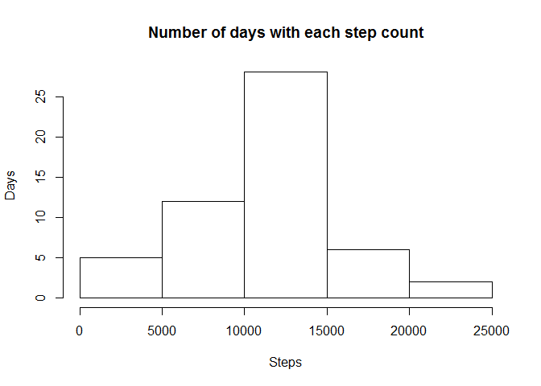

# Reproducible Research: Peer Assessment 1


## Loading and preprocessing the data

Before analysis can be done, we have to load in and clean up the data. At this point all we need to do is make a separate data set that omits the na values. (We keep both data sets so we can use each one as needed.)


```r
data <- read.csv("./activity.csv")
data_no_NAs <- data[complete.cases(data),]
```

## What is mean total number of steps taken per day?

This histogram shows the rough distribution of how many days had a rough step count, which provides context for the summary statistics that follow.

```r
stepsEachDay <- with(data_no_NAs, tapply(steps, as.factor(date), sum, na.rm = TRUE))
hist(stepsEachDay, main = "Number of days with each step count", xlab = "Steps", ylab = "Days")
```

 

```r
summary(stepsEachDay)
```

```
##    Min. 1st Qu.  Median    Mean 3rd Qu.    Max.    NA's 
##      41    8841   10760   10770   13290   21190       8
```

## What is the average daily activity pattern?

In the above question we looked at the data sliced into days and we started to see how many days were really active, how many were not, and what the average level of activity per day is. But now we're going to look at something different. On average, what are the activity levels like based on time of day? (The data is in five minute chunks on a 24 clock. So 2255 can be interpreted as "22:55" - or 10:55pm.)

```r
avgStepsByInterval <- with(data_no_NAs, aggregate(steps, list(interval), mean))
plot(avgStepsByInterval[,1], avgStepsByInterval[,2], type = "l", xlab = "Time Interval", ylab = "Avg Steps")
# isolate coordinates of where the maximum value is so we can label it on the plot
maxStepsRow <- which.max(avgStepsByInterval[,2])
maxStepsX <- avgStepsByInterval[maxStepsRow,1]
maxStepsY <- avgStepsByInterval[maxStepsRow,2]
points(maxStepsX, maxStepsY, pch = 19, col = "red")
text(maxStepsX, maxStepsY, labels = paste("@ Time interval ", maxStepsX), pos = 4)
```

 

Most active at 8:35am. Looks like we got an early bird!

## Imputing missing values


## Are there differences in activity patterns between weekdays and weekends?
