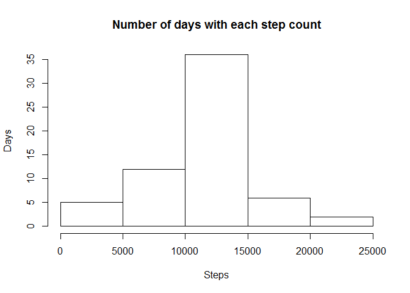

# Reproducible Research: Peer Assessment 1


## Loading and preprocessing the data

Before analysis can be done, we have to load in and clean up the data. At this point all we need to do is make a separate data set that omits the na values. (We keep both data sets so we can use each one as needed.)


```r
data <- read.csv("./activity.csv")
data_no_NAs <- data[complete.cases(data),]
```

## What is mean total number of steps taken per day?

This histogram shows the rough distribution of how many days had a rough step count, which provides context for the summary statistics that follow.

```r
stepsEachDay <- with(data_no_NAs, tapply(steps, as.factor(date), sum, na.rm = TRUE))
hist(stepsEachDay, main = "Number of days with each step count", xlab = "Steps", ylab = "Days")
```

 

```r
summary(stepsEachDay)
```

```
##    Min. 1st Qu.  Median    Mean 3rd Qu.    Max.    NA's 
##      41    8841   10760   10770   13290   21190       8
```

## What is the average daily activity pattern?

In the above question we looked at the data sliced into days and we started to see how many days were really active, how many were not, and what the average level of activity per day is. But now we're going to look at something different. On average, what are the activity levels like based on time of day? (The data is in five minute chunks on a 24 clock. So 2255 can be interpreted as "22:55" - or 10:55pm.)

```r
avgStepsByInterval <- with(data_no_NAs, aggregate(steps, list(interval), mean))
plot(avgStepsByInterval[,1], avgStepsByInterval[,2], type = "l", xlab = "Time Interval", ylab = "Avg Steps")
# isolate coordinates of where the maximum value is so we can label it on the plot
maxStepsRow <- which.max(avgStepsByInterval[,2])
maxStepsX <- avgStepsByInterval[maxStepsRow,1]
maxStepsY <- avgStepsByInterval[maxStepsRow,2]
points(maxStepsX, maxStepsY, pch = 19, col = "red")
text(maxStepsX, maxStepsY, labels = paste("@ Time interval ", maxStepsX), pos = 4)
```

 

Most active at 8:35am. Looks like we got an early bird!

## Imputing missing values

The original dataset has some missing values. We've worked around those so far, but let's see what we can do to come up with new values that make sense. Luckily, in the last step we've constructed ourselves a pretty good lookup table - for every time interval, we know the average steps taken. In general this is not a good idea, but is defensible for our purposes.

First we have to do the work to impute the data by subsetting the NAs, replacing them with values from the lookup table, and then merging that with the no NAs subset we made earlier. The imputed data set will then be at parity with the original.


```r
NAs <- data[is.na(data),] # grab the NAs so we can replace them
names(avgStepsByInterval) <- c("interval","steps") # renaming columns for merge
imputedNAs <- merge(avgStepsByInterval, NAs, by = "interval")
imputedNAs$steps.y <- NULL # dropping the unnecessary column created by merge
names(imputedNAs)[2] <- "steps"
data_imputed <- rbind(data_no_NAs, imputedNAs) # combining into one data frame
data_imputed <- with(data_imputed, data_imputed[order(date, interval),]) # re-order data
```

Now that we've done that, we can re-compute the histograms and summary statistics to find out the steps/day and see if there's any significant differences in the imputed data set.


```r
stepsEachDay_i <- with(data_imputed, tapply(steps, as.factor(date), sum, na.rm = TRUE))
hist(stepsEachDay_i, main = "Number of days with each step count", xlab = "Steps", ylab = "Days")
```

 

```r
summary(stepsEachDay_i)
```

```
##    Min. 1st Qu.  Median    Mean 3rd Qu.    Max. 
##      41    9819   10770   10770   12810   21190
```

The mean remains unchanged, but the median has shifted over as a result of us adding in several identical days that are all exactly the mean. The chart reflects this, too; the imputed data just served to make the middle bar larger (as opposed to uniformly scaling the data set).

## Are there differences in activity patterns between weekdays and weekends?

Good question! Let's first make a factor variable so we can tell which data are from weekdays and which are from weekends.


```r
data_imputed$daytype <- as.factor(ifelse(weekdays(as.Date(data_imputed$date)) %in% c("Saturday", "Sunday"),
                                         "weekend", 
                                         "weekday"))
```

That looks complicated only because of all the typecasting we needed to do, but the end result is a new column with a factor variable called daytype, with levels "weekday" or "weekend" as appropriate. Now lets use the lattice package to see how the data differs based on this new factor variable.


```r
library("lattice")
avgStepsIntAndWkdy <- with(data_imputed, aggregate(steps, list(interval = interval, daytype = daytype), mean))
names(avgStepsIntAndWkdy)[3] <- "steps"
xyplot(steps ~ interval | daytype,
        data = avgStepsIntAndWkdy,
        type = "l",
        layout = c(1,2))
```

 

There does seem to be some difference in activity. In particular, the activity starts gearing up a lot later on the weekends and, though never peeks as highly as it does during the week, is overall much mroe sustained going into the evening hours.
